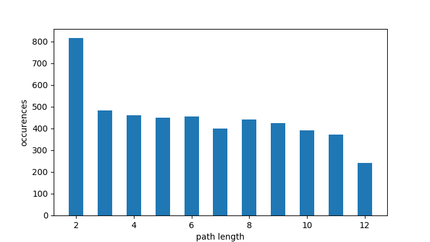

This is part of the code of the paper [(Pichat, 2015) A multipath approach to histology volume reconstruction](http://discovery.ucl.ac.uk/1468614/3/ISBI2015_tig.pdf)

## counting (s,t)-paths in a graph

We look for all the simple paths that connect vertices `s` and `t` (i.e., the (s,t)-paths) in an undirected graph of order n.

`get_paths` takes as inputs: the adjacency matrix of a graph, a `start` and `end` vertices, and returns an exhaustive list of all the (s,t)-paths (and thereby their exact count).

The adjacency matrix may be that of a random graph, generated using `random_adjacency_matrix`, or more specifically that of the graph G in (Pichat, 2015), generated using `our_adjacency_matrix`. 

In the following, we comment and detail that special case. G has vertices of degrees:
 - at least &epsilon; and at most 2&epsilon; if 1&le;&epsilon;&le;floor(n/2) 
 - at least &epsilon; and at most n-1 if floor(n/2)&lt;&epsilon;&lt;n-1
 - min(deg)=max(deg)=n-1 otherwise. 

&epsilon; is a parameter that tells up to how many adjacent vertices one vertex is connected with "above" and "below" (assuming the set of vertices is a sequence of increasing integers [0,1,...,n], such that "above" and "below" refer to greater or smaller vertex values). Note that degrees of vertices at both ends must be less than 2&epsilon;.

_NB1_: 
 - if &epsilon;=1, G is a path graph,
 - if 1&lt;&epsilon;&lt;n-2, G is &epsilon;-connected,
 - if &epsilon;=n-1, G is a complete graph.

The sequence of vertex degrees, S, can be obtained (1) by convolution: 
 - S=f&lowast;g where f=[1,1,...,1]&isin;&Ropf;<sup>n</sup> and g=[1,..,1,0,1,..,1]&isin;&Ropf;<sup>2&epsilon;+1</sup> (there are &epsilon; ones on each side of the central zero; that zero is used so that no vertex is self-connected). 
 - One easily verifies that if &epsilon;&ge;n-1, then S=[n-1,n-1,...,n-1]&isin;&Ropf;<sup>n</sup> (i.e., the graph is complete).
 - ex: for n=6 vertices, &epsilon;=2, the sequence of degrees is: S=[2,3,4,4,3,2].

A more straightforward way consists of (2) summing the elements of each row (or column) of its adjacency matrix. Using the same parameters, we have A:
<table>
  <tr> <td bgcolor="#ff9999">0</td> <td bgcolor="#b3ffb3">1</td> <td bgcolor="#b3ffb3">1</td> <td bgcolor="#ff9999">0</td> <td bgcolor="#ff9999">0</td> <td bgcolor="#ff9999">0</td> </tr>
  <tr> <td bgcolor="#b3ffb3">1</td> <td bgcolor="#ff9999">0</td> <td bgcolor="#b3ffb3">1</td> <td bgcolor="#b3ffb3">1</td> <td bgcolor="#ff9999">0</td> <td bgcolor="#ff9999">0</td> </tr>
  <tr> <td bgcolor="#b3ffb3">1</td> <td bgcolor="#b3ffb3">1</td> <td bgcolor="#ff9999">0</td> <td bgcolor="#b3ffb3">1</td> <td bgcolor="#b3ffb3">1</td> <td bgcolor="#ff9999">0</td> </tr>
  <tr> <td bgcolor="#ff9999">0</td> <td bgcolor="#b3ffb3">1</td> <td bgcolor="#b3ffb3">1</td> <td bgcolor="#ff9999">0</td> <td bgcolor="#b3ffb3">1</td> <td bgcolor="#b3ffb3">1</td> </tr>
  <tr> <td bgcolor="#ff9999">0</td> <td bgcolor="#ff9999">0</td> <td bgcolor="#b3ffb3">1</td> <td bgcolor="#b3ffb3">1</td> <td bgcolor="#ff9999">0</td> <td bgcolor="#b3ffb3">1</td>  </tr>
  <tr> <td bgcolor="#ff9999">0</td> <td bgcolor="#ff9999">0</td> <td bgcolor="#ff9999">0</td> <td bgcolor="#b3ffb3">1</td> <td bgcolor="#b3ffb3">1</td> <td bgcolor="#ff9999">0</td> </tr>
</table> 

which yields the same sequence, S=[2,3,4,4,3,2].

_NB2_: the number of diagonals of ones above (resp. below) the main diagonal is &epsilon; (and it is bounded by n-1, in which case the graph is complete--without self-connections).

__Question:__ What are all the (3,2)-paths in G (adjacency matrix is A)? (the case &epsilon;=1 is trivial and gives only `[3, 2]`)

__Answer:__ `[[3, 1, 0, 2], [3, 1, 2], [3, 2], [3, 4, 2], [3, 5, 4, 2]]`

_NB3_: choosing n=12 and &epsilon;=n-1 gives 9,864,101 different paths.

Back to the general case, the problem of finding the number (or a formula/procedure to obtain/estimate that number) of `(s,t)`-paths of a certain length in a random graph is complicated (it is \#P-complete)...Interesting answers are given in [(Roberts and Kroese, 2007)](https://people.smp.uq.edu.au/DirkKroese/ps/robkro_rev.pdf). Also check [here](http://citeseerx.ist.psu.edu/viewdoc/download;jsessionid=EC4731136167A4EB6D39E68680065D4B?doi=10.1.1.156.345&rep=rep1&type=pdf).

`naive_path_generation` implements algorithm 1 in (Roberts and Kroese, 2007) and estimates that number.

For example, given the following adjacency matrix:
```python
A=
[[0 0 0 0 1 0 1 0 1 1 1 0 1 1 0]
 [0 0 1 0 0 0 0 1 1 0 0 1 1 1 1]
 [0 1 0 0 0 0 0 0 1 0 0 1 0 1 0]
 [0 0 0 0 1 1 1 1 0 0 1 0 1 1 0]
 [1 0 0 1 0 0 1 0 1 0 0 0 0 1 0]
 [0 0 0 1 0 0 0 0 1 1 0 0 0 1 0]
 [1 0 0 1 1 0 0 0 1 0 0 1 1 0 1]
 [0 1 0 1 0 0 0 0 0 0 1 0 0 0 0]
 [1 1 1 0 1 1 1 0 0 0 0 0 1 0 0]
 [1 0 0 0 0 1 0 0 0 0 0 1 0 0 1]
 [1 0 0 1 0 0 0 1 0 0 0 1 0 0 0]
 [0 1 1 0 0 0 1 0 0 1 1 0 0 0 0]
 [1 1 0 1 0 0 1 0 1 0 0 0 0 0 0]
 [1 1 1 1 1 1 0 0 0 0 0 0 0 0 0]
 [0 1 0 0 0 0 1 0 0 1 0 0 0 0 0]]
==> start/end: 12->3
==> exact number of paths: 26665
==> [naive] estimated number of paths: 24462
```

Here is the distribution of lengths of paths returned after 400.000 runs of `naive_path_generation`. We can first observe that the estimated number is close to the exact number of paths, though incorrect; this could be improved by increasing the number of runs (relatively to the actual number of paths). Second, we can clearly observe the bias toward short paths (as pointed out by the authors).


